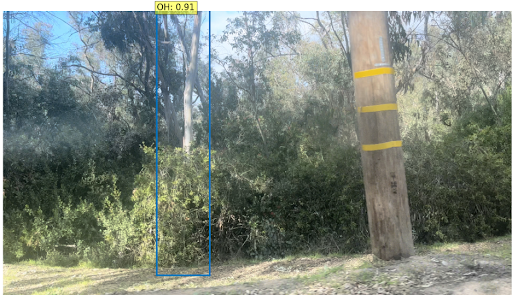
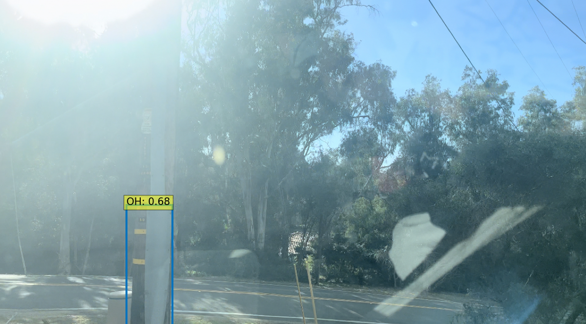

# Results
<!-- 

-->

## DETR Object Detection Results
Looking at the figure below, we can see that there was a consistent decrease in the loss when the DETR model was trained on the 515 manually captured images of overhead structures, while the validation set produced a more erratic trend. 
Additionally, we can also see that the model incorrectly mistook a tree in the background with a considerably high confidence of 0.91 in the left photo, the model identifies the pole correctly in the second image despite the unfavorable lighting. In other images in the validation set, the model appears to have no trouble identifying poles in the photo particularly when they have identifiable markers such as yellow bands or ID numbers across their base. While confusion between trees and wooden poles is a misstep for the DETR model, the mistake is infrequent, and the model often was shown to display a commendable capability to distinguish between the two.

  

    
  

  

    
  

## NLP Model Results
The SVM topic classification model resulted in an accuracy of 98% on the HumAID test data after being trained to differentiate between "request or urgent needs" and "infrastructure and utility damage". In further validating the model on the minimal dataset of artificial pole reviews, the model returns an incorrect classification of four out of thirteen pole reports, all of which fell under the "requests or urgent needs". This seems to reflect the model's slight deficiency in identifying the more urgent, humanitarian reports in contrast to the infrastructure-related ones.

Lastly, because the VADER sentiment analysis model is a pre-trained model, we need only but to observe the results on the text it is given. On a section of the HumAID data, the model appeared to understand the nuances and exaggerations of the tweets to a considerable level of accuracy. This level of perception when the VADER model was customized with pole issue related words seems to have carried over. For example, upon giving it the sample report of "I saw this pole next to a tree, and it seemed too exposed to the weather", the model evaluated it with a compound score of -0.3182, giving it an overall negative sentiment. While an uncustomized VADER would have evaluated the text as neutral, we observed that the model is conscious of the desired nuances. However, despite its successes, the model, when given combined levels of positive and negative sentiments, still displays a vulnerability to mistaken evaluations of the overall sentiment.

# Future Work
We recognize the boundaries in which our platform is confined; however, this first iteration of CERA serves as a proof of concept. We have much more to explore.

- **Risk Score Based on Image Analysis**: Integrate advanced models to identify additional risk factors such as overhanging tree branches, leaning poles, wear and tear
- **GenAI Incorporation**: Combine Generative AI with machine learning  validation and UX process to enhance the platform.
- **Historical Data for Predictive Risk Scoring**: Utilize collected images and assessments on utility pole issues to predict future risk scenarios.

- **Community Engagement and Education**: Use the platform to educate the community about utility safety. Gamify reporting process, and reward users for active participation. Include user feedback feature for greater interaction and enhancement.

[back](./)

