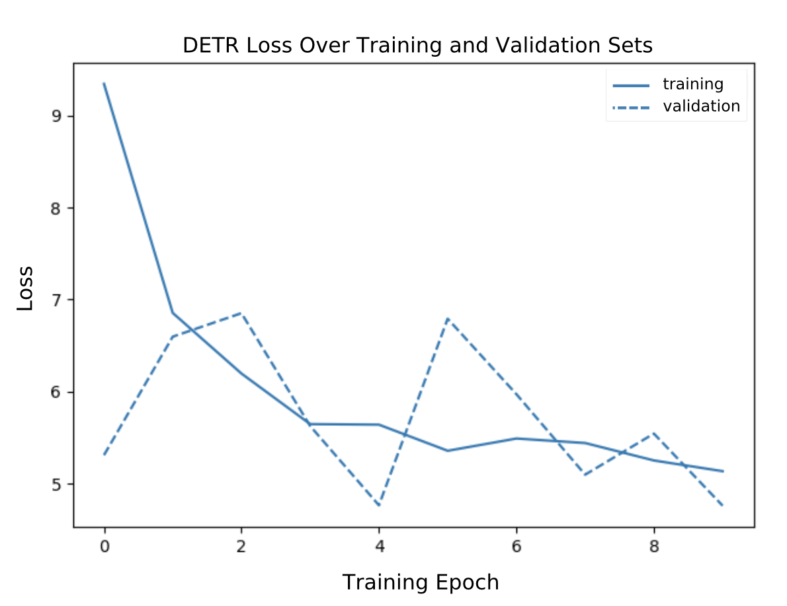

# Results

# Future Work
We recognize the boundaries in which our platform is confined; however, this first iteration of CERA serves as a proof of concept. We have much more to explore.

- **Risk Score Based on Image Analysis**: Integrate advanced models to identify additional risk factors such as overhanging tree branches, leaning poles, wear and tear
- **GenAI Incorporation**: Combine Generative AI with machine learning  validation and UX process to enhance the platform.
- **Historical Data for Predictive Risk Scoring**: Utilize collected images and assessments on utility pole issues to predict future risk scenarios.

- **Community Engagement and Education**: Use the platform to educate the community about utility safety. Gamify reporting process, and reward users for active participation. Include user feedback feature for greater interaction and enhancement.

[back](./)

